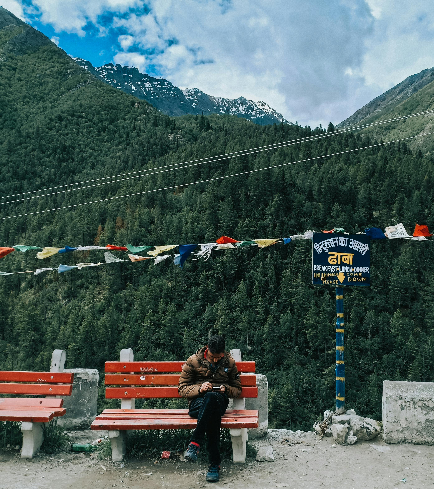
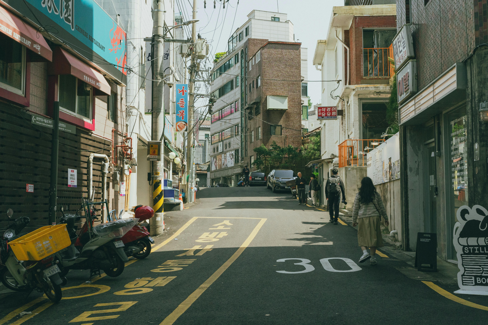
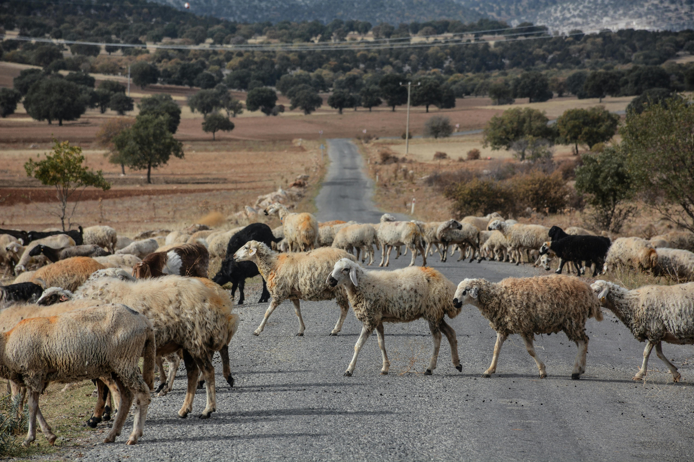

# HTML Code

```
<!DOCTYPE html>
<head>
  <meta charset="UTF-8">
  <meta name="viewport" content="width=device-width, initial-scale=1.0">
  <title>Wanderlust Chronicles - Travel Blog</title>
  <link rel="stylesheet" href="css/blog.css">
</head>
<body>
  <!-- Header -->
  <header class="header">
    <div class="container">
      <div class="header-content">
        <a href="#" class="logo">🌍 Wanderlust Chronicles</a>
        <nav class="nav">
          <a href="#home">Home</a>
          <a href="#destinations">Destinations</a>
          <a href="#tips">Travel Tips</a>
          <a href="#about">About</a>
          <a href="#contact">Contact</a>
        </nav>
      </div>
    </div>
  </header>
  <!-- Main Content -->
  <main class="container">
    <div class="main-content">
      <section class="main-section">
        <!-- Featured Post -->
        <article class="featured-post">
          
          <div class="featured-content">
            <h1 class="featured-title">Chasing Peaks in Ukraine</h1>
            <p class="featured-excerpt">One might imagine finding solitude in a war-stricken nation like Ukraine may prove to be impossible. Yet, there is something cathartic about the Carpathian peaks. Shrouded in mist and wildflowers, it's a reminder of what we've lost, and what could have been. The weight of struggle is heavy in the air, but a sight like ... <a href="#" class="read-more">Continue Reading</a>
          </div>
        </article>
        <!-- Recent Posts Section -->
        <section>
          <h2 class="section-title">Recent Adventures</h2>
          <div class="posts-grid">
            <article class="post-card">
              
              <div class="post-content">
                <h3 class="post-title">The Duality of Japan</h3>
                <p class="post-excerpt">From the bustling, neon-lit streets of Tokyo to the sizzling Takoyaki and warm laughter of Osaka, I've discovered a side to Japan ... </p>
                <a href="#" class="post-link">Read More →</a>
              </div>
            </article>
            <article class="post-card">
              
              <div class="post-content">
                <h3 class="post-title">A Beginner's Guide to the Himalayas</h3>
                <p class="post-excerpt">Prayer flags and piping hot chai, every peak is both a blessing and a curse. How to tell if that trail leads to a gentle valley or a world-class climb? ... </p>
                <a href="#" class="post-link">Read More →</a>
              </div>
            </article>
            <article class="post-card">
              
              <div class="post-content">
                <h3 class="post-title">Lost in Mexico</h3>
                <p class="post-excerpt">I can still taste the fresh tortillas right off the streets on my tongue. Beyond the maze of colours that flood the city, hidden in the jungles...</p>
                <a href="#" class="post-link">Read More →</a>
              </div>
            </article>
            <article class="post-card">
              
              <div class="post-content">
                <h3 class="post-title">Temples and Thai Tides</h3>
                <p class="post-excerpt">This was a long-awaited trip, I've heard it all about the Thai smiles and the spicy street food, but trying the real thing ...</p>
                <a href="#" class="post-link">Read More →</a>
              </div>
            </article>
            <article class="post-card">
              
              <div class="post-content">
                <h3 class="post-title">Beyond Athens</h3>
                <p class="post-excerpt">Greece has to be one of the most magical places I've ever been to. You can feel the history in the cobbled streets and blue skies ...</p>
                <a href="#" class="post-link">Read More →</a>
              </div>
            </article>
            <article class="post-card">
              
              <div class="post-content">
                <h3 class="post-title">A Lesson in Historical Trekking</h3>
                <p class="post-excerpt">Three weeks trekking by the Nile, from the metropolis to the necropolis, I've learnt more about history and ...</p>
                <a href="#" class="post-link">Read More →</a>
              </div>
            </article>
          </div>
        </section>
      </section>
      <!-- Sidebar -->
      <aside class="sidebar">
        <section class="sidebar-section">
          <h3 class="sidebar-title">About Me</h3>
          <p class="bio-text">Hey there, digital traveler! I'm Harry, a hiker, a history nerd, and a massive foodie, all at the same time. I'm happiest with a pack on my bag and a horizon before my eyes. If you don't find me jotting down the next urban legend, or sweating it out over another impossible peak, you'll find me curled up with my cat in my cozy little nook at home in Bangalore. </p>
        </section>
        <section class="sidebar-section">
          <h3 class="sidebar-title">Categories</h3>
          <ul class="categories-list">
            <li>
              <a href="#">Epic Quests in the Wild</a>
            </li>
            <li>
              <a href="#">World Archeology</a>
            </li>
            <li>
              <a href="#">Beyond Salt and Pepper</a>
            </li>
            <li>
              <a href="#">How To's</a>
            </li>
            <li>
              <a href="#">Budgeting Tips</a>
            </li>
            <li>
              <a href="#">Solo Travel</a>
            </li>
            <li>
              <a href="#">Environmentalism is Easy!</a>
            </li>
          </ul>
        </section>
      </aside>
    </div>
  </main>
  <!-- Footer -->
  <footer class="footer">
    <div class="container">
      <div class="footer-content">
        <section class="footer-section">
          <h3 class="footer-title">Follow My Journey</h3>
          <div class="instagram-grid">
            
            
            
            
            
            
          </div>
          <p>@wanderlustchronicles</p>
        </section>
        <section class="footer-section">
          <h3 class="footer-title">Never Miss an Adventure</h3>
          <p>Subscribe to my newsletter to get fresh travel tips and exclusive content for free, straight to your inbox.</p>
          <form class="newsletter-form">
            <input type="email" placeholder="Your email address" class="newsletter-input" required>
            <button type="submit" class="newsletter-button">Subscribe</button>
          </form>
        </section>
      </div>
    </div>
  </footer>
  <!-- Back to Top Button - Always Visible -->
  <a href="#" class="back-to-top">↑</a>
</body>
</html>
```

# CSS Code
```
* {

    margin: 0;

    padding: 0;

    box-sizing: border-box;

}

:root {

    --forest-green: #2d5a3d;

    --sage-green: #7a9b76;

    --ocean-blue: #4a90a4;

    --earth-brown: #8b7355;

    --sand-beige: #f5f1eb;

    --warm-white: #fefefe;

    --text-dark: #2c3e50;

    --text-light: #6c757d;

}

body {

    font-family: 'Georgia', 'Times New Roman', serif;

    line-height: 1.6;

    color: var(--text-dark);

    background-color: var(--warm-white);

}

/* Fonts */

h1,

h2,

h3 {

    font-family: 'Georgia', serif;

    font-weight: 400;

    line-height: 1.3;

    margin-bottom: 0.5em;

}

a {

    color: var(--ocean-blue);

    text-decoration: none;

    transition: color 0.3s ease;

}

a:hover {

    color: var(--forest-green);

}

/* Layout */

.container {

    max-width: 75rem;

    margin: 0 auto;

    padding: 0 1rem;

}

.main-content {

    display: flex;

    flex-direction: column;

    gap: 2rem;

    padding: 2rem 0;

}

/* Header */

.header {

    background: linear-gradient(135deg, var(--forest-green), var(--sage-green));

    color: white;

    padding: 1rem 0;

    position: sticky;

    top: 0;

    z-index: 100;

    box-shadow: 0 0.125rem 0.25rem rgba(0, 0, 0, 0.1);

}

.header-content {

    display: flex;

    justify-content: space-between;

    align-items: center;

    flex-wrap: wrap;

}

.logo {

    font-size: 1.5rem;

    font-weight: bold;

    color: white;

}

.nav {

    display: flex;

    gap: 1.5rem;

    flex-wrap: wrap;

}

.nav a {

    color: white;

    font-size: 0.9rem;

    padding: 0.5rem;

    border-radius: 0.25rem;

    transition: background-color 0.3s ease;

}

.nav a:hover {

    background-color: rgba(255, 255, 255, 0.1);

}

/* Featured Post */

.featured-post {

    background: white;

    border-radius: 0.5rem;

    overflow: hidden;

    box-shadow: 0 0.25rem 1rem rgba(0, 0, 0, 0.1);

    transition: transform 0.3s ease, box-shadow 0.3s ease;

}

.featured-post:hover {

    transform: translateY(-0.125rem);

    box-shadow: 0 0.5rem 1.5rem rgba(0, 0, 0, 0.15);

}

.featured-image {

    width: 100%;

    height: 20rem;

    object-fit: cover;

    display: block;

}

.featured-content {

    padding: 1.5rem;

}

.featured-title {

    color: var(--forest-green);

    margin-bottom: 0.75rem;

}

.featured-excerpt {

    color: var(--text-light);

    font-size: 1.1rem;

    line-height: 1.7;

    margin-bottom: 1rem;

}

.read-more {

    display: inline-block;

    background: var(--ocean-blue);

    color: white;

    padding: 0.75rem 1.5rem;

    border-radius: 0.25rem;

    font-size: 0.9rem;

    transition: background-color 0.3s ease;

}

.read-more:hover {

    background: var(--forest-green);

}

/* Recent Posts */

.section-title {

    color: var(--forest-green);

    text-align: center;

    margin-bottom: 2rem;

    font-size: 2rem;

}

.posts-grid {

    display: grid;

    grid-template-columns: 1fr;

    gap: 1.5rem;

    margin-bottom: 3rem;

}

.post-card {

    background: white;

    border-radius: 0.5rem;

    overflow: hidden;

    box-shadow: 0 0.125rem 0.5rem rgba(0, 0, 0, 0.1);

    transition: transform 0.3s ease, box-shadow 0.3s ease;

}

.post-card:hover {

    transform: translateY(-0.125rem);

    box-shadow: 0 0.25rem 1rem rgba(0, 0, 0, 0.15);

}

.post-image {

    width: 100%;

    height: 12rem;

    object-fit: cover;

    display: block;

}

.post-content {

    padding: 1rem;

}

.post-title {

    color: var(--forest-green);

    font-size: 1.1rem;

    margin-bottom: 0.5rem;

}

.post-excerpt {

    color: var(--text-light);

    font-size: 0.9rem;

    margin-bottom: 0.75rem;

}

.post-link {

    font-size: 0.85rem;

    font-weight: bold;

}

/* Sidebar */

.sidebar {

    background: var(--sand-beige);

    padding: 1.5rem;

    border-radius: 0.5rem;

    margin-bottom: 2rem;

}

.sidebar-section {

    margin-bottom: 2rem;

}

.sidebar-title {

    color: var(--forest-green);

    border-bottom: 0.125rem solid var(--sage-green);

    padding-bottom: 0.5rem;

    margin-bottom: 1rem;

}

.bio-text {

    color: var(--text-light);

    line-height: 1.6;

}

.categories-list {

    list-style: none;

}

.categories-list li {

    margin-bottom: 0.5rem;

}

.categories-list a {

    display: block;

    padding: 0.5rem;

    background: white;

    border-radius: 0.25rem;

    transition: background-color 0.3s ease;

}

.categories-list a:hover {

    background: var(--sage-green);

    color: white;

}

/* Footer */

.footer {

    background: var(--earth-brown);

    color: white;

    padding: 2rem 0;

}

.footer-content {

    display: flex;

    flex-direction: column;

    gap: 2rem;

}

.footer-section {

    text-align: center;

}

.footer-title {

    color: white;

    margin-bottom: 1rem;

}

.instagram-grid {

    display: grid;

    grid-template-columns: repeat(3, 1fr);

    gap: 0.5rem;

    margin-bottom: 1rem;

}

.instagram-thumb {

    width: 100%;

    height: 5rem;

    object-fit: cover;

    border-radius: 0.25rem;

}

.newsletter-form {

    display: flex;

    flex-direction: column;

    gap: 0.75rem;

    max-width: 20rem;

    margin: 0 auto;

}

.newsletter-input {

    padding: 0.75rem;

    border: none;

    border-radius: 0.25rem;

    font-size: 1rem;

}

.newsletter-button {

    background: var(--ocean-blue);

    color: white;

    padding: 0.75rem;

    border: none;

    border-radius: 0.25rem;

    font-size: 1rem;

    cursor: pointer;

    transition: background-color 0.3s ease;

}

.newsletter-button:hover {

    background: var(--forest-green);

}

/* Back to Top */

.back-to-top {

    position: fixed;

    bottom: 2rem;

    right: 2rem;

    background: var(--ocean-blue);

    color: white;

    width: 3rem;

    height: 3rem;

    border-radius: 50%;

    display: flex;

    align-items: center;

    justify-content: center;

    font-size: 1.25rem;

    transition: background-color 0.3s ease;

    z-index: 1000;

}

.back-to-top:hover {

    background: var(--forest-green);

}

/* Responsiveness */

@media (min-width: 48rem) {

    .header-content {

        flex-wrap: nowrap;

    }

    .main-content {

        flex-direction: row;

        gap: 3rem;

    }

    .main-section {

        flex: 2;

    }

    .sidebar {

        flex: 1;

        margin-bottom: 0;

        align-self: flex-start;

    }

    .posts-grid {

        grid-template-columns: repeat(2, 1fr);

    }

    .footer-content {

        flex-direction: row;

        justify-content: space-around;

        text-align: left;

    }

    .newsletter-form {

        flex-direction: row;

        max-width: none;

    }

    .newsletter-input {

        flex: 1;

    }

}

@media (min-width: 64rem) {

    .posts-grid {

        grid-template-columns: repeat(3, 1fr);

    }

    .instagram-grid {

        grid-template-columns: repeat(6, 1fr);

    }

    h1 {

        font-size: 2.5rem;

    }

    h2 {

        font-size: 2rem;

    }

}
```