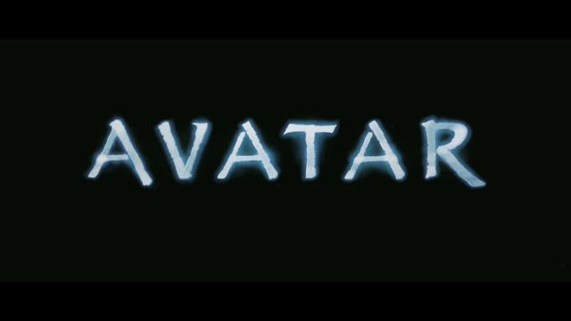
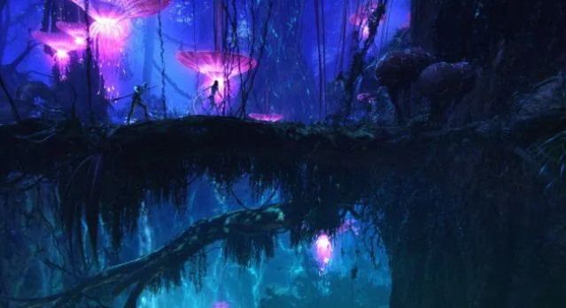
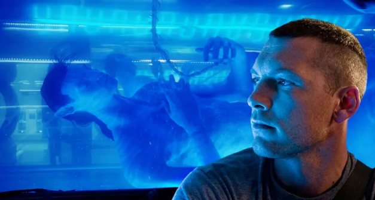
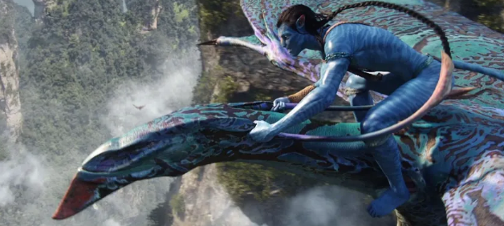
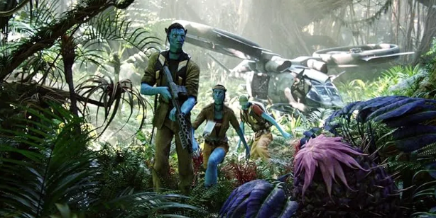
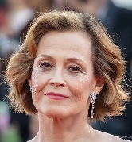

# HTML Code:

```
<!DOCTYPE html>
<html lang="en">
  <head>
    <meta charset="UTF-8">
    <title>Avatar Movie Info</title>
    <link rel="stylesheet" href="css/movie.css">
  </head>
  <body>
    <header class="header">
      <h1>Avatar</h1>
      <p>Genre: Science Fiction | Release Year: 2009</p>
    </header>
    <section class="banner">
      
      <br>
      <br>
    </section>
    <section class="synopsis">
      <h2>Synopsis</h2>
      <p>             "Avatar" is a science fiction epic set in the mid-22nd century on Pandora, a lush moon inhabited by the             Na’vi, a tall, blue-skinned species. Jake Sully, a paraplegic former Marine, is sent to Pandora to operate             an avatar — a genetically engineered Na’vi body — to interact with the locals. As he integrates into Na’vi             society, he learns their culture and deep connection to nature. Torn between following orders from the human             corporation exploiting Pandora’s resources and protecting the Na’vi, Jake faces a moral choice. The story             explores themes of environmentalism, colonialism, and identity against a visually stunning alien backdrop.         </p>
    </section>
    <br>
    <br>
    <section class="images">
      <h2>Images</h2>
      <div class="images-grid">
        
        
        
        
      </div>
    </section>
    <br>
    <br>
    <section class="cast">
      <h2>Cast</h2>
      <div class="cast-grid">
        <div class="card">
          <a href="https://www.imdb.com/name/nm0941777/" target="_blank">
            
          </a>
          <p>Sam Worthington <br>
            <small>Jake Sully</small>
          </p>
        </div>
        <div class="card">
          <a href="https://www.imdb.com/name/nm0757855/" target="_blank">
            
          </a>
          <p>Zoe Saldana <br>
            <small>Neytiri</small>
          </p>
        </div>
        <div class="card">
          <a href="https://www.imdb.com/name/nm0000244/" target="_blank">
            
          </a>
          <p>Sigourney Weaver <br>
            <small>Dr. Grace Augustine</small>
          </p>
        </div>
        <div class="card">
          <a href="https://www.imdb.com/name/nm0002332/" target="_blank">
            
          </a>
          <p>Stephen Lang <br>
            <small>Colonel Miles Quaritch</small>
          </p>
        </div>
        <div class="card">
          <a href="https://www.imdb.com/name/nm0735442/" target="_blank">
            
          </a>
          <p>Michelle Rodriguez <br>
            <small>Trudy Chacon</small>
          </p>
        </div>
        <div class="card">
          <a href="https://www.imdb.com/name/nm0000610/" target="_blank">
            
          </a>
          <p>Giovanni Ribisi <br>
            <small>Parker Selfridge</small>
          </p>
        </div>
      </div>
    </section>
    <br>
    <br>
    <section class="reviews">
      <h2 style="text-align: center;">User Reviews</h2>
      <div>
        <p>"You know the feeling when you start watching a movie, realizing it's almost 3 hours, and                 saying to yourself - "Well this is probably gonna be mostly boring", well, the creators of this movie                 didn't                 let that happen, rest assures.From the beginning up until the ending, every scene is perfected,                 with amazing acting, stunning directing, great visual effects, and astounding sound effects.                 The story building is just great, characters are well-developed, and the concept is brilliant. The only                 thing                 that's missing to me, is a fitting-soundtrack which could've give some scenes a great boost.I avoided                 watching                 this movie for a long time, because it just seemed a little ridiculous to me (Come on there are blue                 people)                 but I'm so glad I finally decides to give it a chance, and boy did it serve.                 Loved it. 9.5/10."</p>
        <cite>- Benjamin Heckendorn</cite>
      </div>
      <br>
      <br>
      <div>
        <p>"A film with the scope of James Cameron's Avatar was always going to be a risk both artistically and                 financially, especially in today's economic climate. Whether it will pay off monetarily is a question                 only time can answer, but this viewer can at the very least attest to it being an artistic triumph.                 Avatar brings us as close as cinema ever has to actually visiting an alien world. The beautiful                 environs, the exotic creatures and incredibly lifelike natives of Pandora arrest the senses, visually,                 aurally and emotionally. The world in Avatar is the true star of the show. The amount of detail and work                 that has gone into bringing this new world alive is seriously impressive, and it will be a while before                 we see anything that overtakes it in scope and quality. WETA Workshop and ILM have truly outdone                 themselves.                 Relative newcomer, Aussie Sam Worthington provides a solid human heart amongst all the                 science-fiction/fantasy beauty and Zoe Saldana gives an impressive performance as the 8 foot tall Na'vi,                 Neytiri. Even though the characters they both play are blue, giant, catlike aliens, they managed to                 evoke a chemistry and likability that pierces through the special effects.                 That's not to say that everything is perfect. The story is basic and dare I say, clichéd and                 predictable. We have seen it plenty of times in all forms of media. The bad guys are cartoonishly evil,                 and sadly paper thin. The love story, while charming, is also clichéd despite being between man and                 alien. But in the face of these shortcomings, Avatar is a success because its storytelling lies in the                 brilliant visuals.                 Avatar is a beautiful piece of film and a true event. It does exactly what cinema was always intended to                 - it takes us away from our problems and worries for a few hours and gives us memorable images which                 will undoubtedly and deservedly enter into the cultural lexicon to stay for the foreseeable future"</p>
        <cite>- GoldenEye Online</cite>
      </div>
    </section>
    <br>
    <br>
    <section class="where-to-watch">
      <h2>Where to Watch</h2>
      <a href="https://www.netflix.com/title/70109892" class="buttons" target="_blank">
        
      </a>
      <a href="https://www.amazon.com/Avatar-Sam-Worthington/dp/B0B657C78K" class="buttons" target="_blank">
        
      </a>
      <a href="https://www.disneyplus.com/browse/entity-357d8505-b9bc-41e3-9f27-0414738df143" class="buttons" target="_blank">
        
      </a>
      <a href="https://tv.apple.com/us/movie/avatar/umc.cmc.1hmaf5hccvdvn71dc5hr7mgcj" class="buttons" target="_blank">
        
      </a>
    </section>
    <br>
    <br>
    <br>
    <br>
    <footer class="footer">
      <p>&copy; 2025 3BTCSDS. All rights reserved.</p>
    </footer>
  </body>
</html>
```


# CSS Code

```
@font-face {

    font-family: 'Ava';

    src: url(papyrus.ttf);

    font-weight: normal;

    font-style: normal;

}

@font-face {

    font-family: 'AvaBold';

    src: url(TorukscRegular-z8MA1.ttf);

    font-weight: normal;

    font-style: normal;

}

h2 {

    font-family: AvaBold;

}

body {

    background-image: linear-gradient(to right, #1B2E61, #264189);

    color: #9fd3d8;

}

section {

    animation: fade-up 1s ease-out;

}

@keyframes fade-up {

    from {

        transform: translateY(30px);

        opacity: 0;

    }

    to {

        transform: translateY(0);

        opacity: 1;

    }

}

.header {

    text-align: center;

    font-family: AvaBold;

    font-size: 35px;

    animation-duration: 3s;

    animation-name: slide-in;

}

@keyframes slide-in {

    from {

        transform: translateX(150vw) scale(2, 1);

    }

    to {

        transform: translateX(0) scale(1, 1);

    }

}

.banner img {

    animation: slow-zoom 10s ease-in-out forwards;

}

@keyframes slow-zoom {

    from {

        transform: scale(1);

    }

    to {

        transform: scale(1.05);

    }

}

.synopsis {

    font-family: papyrus;

    width: 80%;

    margin: 0 auto;

    text-align: center;

    animation-delay: 1s;

}

.images {

    padding: 30px;

    max-width: 1000px;

    margin: auto;

    text-align: center;

    animation-delay: 2s;

}

.images h2 {

    margin-bottom: 20px;

}

.images-grid {

    display: flex;

    flex-wrap: wrap;

    gap: 15px;

    justify-content: center;

}

.images-grid img {

    max-width: 220px;

    border-radius: 10px;

    box-shadow: 0 4px 8px rgba(0, 0, 0, 0.6);

    transition: transform 0.3s ease, box-shadow 0.3s ease;

}

.images-grid img:hover {

    transform: scale(1.05);

    box-shadow: 0 6px 15px rgba(0, 0, 0, 0.8);

}

.cast {

    font-family: papyrus;

    width: 80%;

    margin: 0 auto;

    text-align: center;

    animation-delay: 3s;

}

.cast img {

    height: 250px;

    width: 180px;

    object-fit: cover;

}

.cast-grid {

    display: flex;

    flex-wrap: wrap;

    gap: 1.5rem;

    justify-content: center;

}

.card {

    background-color: #1f2833;

    border-radius: 12px;

    overflow: hidden;

    box-shadow: 0 4px 8px rgba(0, 0, 0, 0.7);

    max-width: 200px;

    text-align: center;

    transition: transform 0.3s ease, box-shadow 0.3s ease;

}

.card:hover {

    transform: scale(1.05);

    box-shadow: 0 0 15px #9FD3D8;

}

.card img {

    width: 100%;

    display: block;

    height: auto;

}

.reviews {

    font-family: papyrus;

    width: 80%;

    margin: 0 auto;

    animation-delay: 4s;

}

.where-to-watch {

    font-family: papyrus;

    width: 80%;

    margin: 0 auto;

    text-align: center;

}

.where-to-watch img:hover {

    transform: scale(1.05);

    box-shadow: 0 0 15px #9FD3D8;

}

.buttons {

    margin: 0 24px;

}

.footer {

    font-family: papyrus;

    text-align: center;

}
```